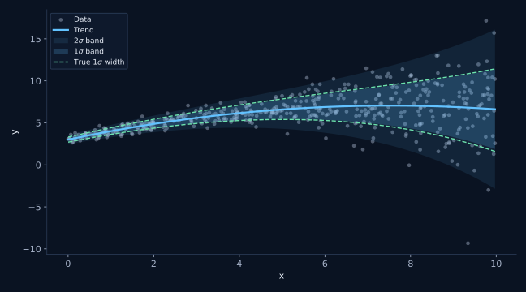
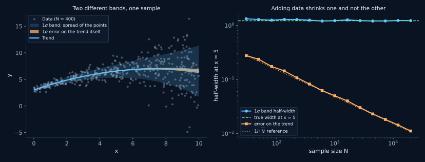

# polyband

**Fit the scatter, not just the mean.**

`polyband` fits a smooth trend through a scatter plot *and* a smooth
description of how wide the scatter is around it, with the degree of each
polynomial chosen independently.

Documentation and worked examples: **https://eartigau.github.io/polyband/**
(bilingual, English and French)



## What problem this solves

You have a cloud of points and you want two things: where the middle of the
cloud goes, and how thick the cloud is. The usual approaches each fall short.

- **Binning in x** gives a jumpy answer that depends on the bin width, says
  nothing between bin centres, and wastes points near the edges.
- **A polynomial fit plus the covariance matrix** answers a different
  question. The covariance gives the uncertainty on the *fitted curve*, which
  shrinks like `1/sqrt(N)`. The thickness of the cloud does not shrink at all
  as you collect more data.
- **A polynomial fit plus a single global RMS** works only if the scatter is
  the same everywhere, which is usually the first thing that fails.

`polyband` fits both polynomials at once by maximum likelihood:

```
y = P_mean(x) + noise,   noise ~ N(0, s(x))
ln s(x) = P_width(x)
```

Because the two are fitted together, the trend is automatically weighted by
the local scatter: points in the noisy part of the x range pull less on the
mean than points in the quiet part.

## Install

```bash
pip install git+https://github.com/eartigau/polyband.git
```

Or, to work on it locally:

```bash
git clone https://github.com/eartigau/polyband.git
cd polyband
pip install -e ".[dev]"
pytest
```

Requires Python 3.9+, numpy and scipy. matplotlib is needed only for the
plotting helpers.

## Quick start

Copy the whole block and run it: it builds its own data, so it works before
you have plugged in yours. The printed values are what you should see.

```python
import numpy as np
import matplotlib.pyplot as plt
from polyband import fit_polyband, plot_polyband

# ---------------------------------------------------------------------
# 1. The data. Replace this whole block with your own x and y.
# ---------------------------------------------------------------------
rng = np.random.default_rng(0)

# 400 points spread over the x range you care about.
x = rng.uniform(0, 10, 400)

# The curve the points scatter around: a parabola that bends back down.
trend = 3.0 + 1.1 * x - 0.075 * x**2

# How wide that scatter is. The point of the package is that this is NOT a
# constant: it grows from 0.30 at x = 0 to 4.95 at x = 10. A single global
# RMS would be wrong at both ends at once.
sigma = np.exp(-1.2 + 0.28 * x)

# One draw per point, each from its own local sigma.
y = trend + rng.normal(0.0, sigma)

# ---------------------------------------------------------------------
# 2. The fit. Two degrees, chosen independently of each other.
# ---------------------------------------------------------------------
#   order_mean=2  : the trend is a parabola, so degree 2.
#   order_width=1 : sigma is an exponential of x, so ln(sigma) is a
#                   straight line, so degree 1.
# Both polynomials are fitted at the same time by maximum likelihood, which
# is what lets the trend be weighted by the local scatter.
fit = fit_polyband(x, y, order_mean=2, order_width=1)

# ---------------------------------------------------------------------
# 3. Reading the result.
# ---------------------------------------------------------------------
print(fit.summary())          # degrees, N, x range, log L, AIC and BIC

print(fit.predict(5.0))       # the trend at x = 5              -> 6.610
print(fit.scatter(5.0))       # half-width of the 1-sigma band  -> 1.234
print(fit.envelope(5.0))      # the two band edges at x = 5     -> (5.376, 7.844)
print(fit.zscore(5.0, 12.3))  # is y = 12.3 unusual at x = 5?   -> 4.61 sigma

# ---------------------------------------------------------------------
# 4. Check it before you trust it.
# ---------------------------------------------------------------------
# About 68% of the points belong inside the 1-sigma band and 95% inside 2
# sigma. A band nobody has checked is decoration, not a measurement.
for nsigma, observed, expected in fit.coverage(x, y):
    print(f"{nsigma:.0f} sigma: {observed:.1%} observed vs {expected:.1%} expected")
# 1 sigma: 66.0% observed vs 68.3% expected
# 2 sigma: 96.2% observed vs 95.4% expected
# 3 sigma: 99.8% observed vs 99.7% expected

# ---------------------------------------------------------------------
# 5. Draw it.
# ---------------------------------------------------------------------
# nsigma=(1, 2) nests two bands. plot_polyband draws on the axis you give it,
# never calls show() or legend() itself, and hands back every artist it
# created so you can restyle afterwards.
art = plot_polyband(fit, x, y, nsigma=(1, 2))
art.ax.legend(handles=art.legend_handles)
plt.show()
```

`order_mean` is the degree of the trend, `order_width` the degree of
`ln(sigma)`. They are independent: a curved trend with a constant-width band
(`2, 0`) is an ordinary combination, and so is a straight trend whose scatter
grows (`1, 1`).

Not sure which degrees to use? Let BIC decide:

```python
from polyband import select_orders

# Fits every combination from (0, 0) up to the two maxima and scores each.
# `fit` is the winner, already fitted; `table` is every combination that
# worked, best first, as (order_mean, order_width, criterion).
fit, table = select_orders(x, y, max_order_mean=4, max_order_width=2)
print(fit.order_mean, fit.order_width)

# Look at the runners-up, not just the winner.
for order_mean, order_width, bic in table[:5]:
    print(f"order_mean={order_mean} order_width={order_width}  BIC={bic:.1f}")
```

Treat a BIC difference below about 2 as a tie and keep the simpler model.

## The band and the trend error are different things

This is the distinction the package is built around, so it is worth stating
plainly:

| | what it describes | behaviour as N grows |
|---|---|---|
| `fit.envelope(x)` | where the **points** lie | converges to the true spread |
| `fit.trend_band(x)` | where the **curve** lies | shrinks like `1/sqrt(N)` |



If you are asking "is this object unusual compared to the population?", you
want the first one. If you are asking "how well do I know the mean relation?",
you want the second.

## Options

| Argument | What it does |
|---|---|
| `order_mean`, `order_width` | Degrees of the two polynomials, independent |
| `log_y=True` | Fit `log10(y)`, for quantities spanning decades or with multiplicative scatter. Results come back in the units of y |
| `yerr=...` | Per-point measurement errors, so the fitted width is the *intrinsic* scatter rather than the observed spread |
| `nu=4` | Student-t likelihood, for samples with outliers |
| `dof_correction=True` | Undo the downward bias of maximum-likelihood widths. On by default |
| `n_bootstrap=300` | Estimate the coefficient covariance by resampling instead of from the Hessian |

## Always check the band

A band nobody has checked is a decoration. Two lines:

```python
for nsigma, observed, expected in fit.coverage(x, y):
    print(f"{nsigma:.0f} sigma: {observed:.1%} observed, {expected:.1%} expected")
```

and, for the full picture, `plot_diagnostics(fit, x, y)`: standardised
residuals against x, their distribution, a quantile-quantile plot, and a
coverage curve. A funnel shape in the first panel means `order_width` is too
low; a wave means `order_mean` is.

## Examples

Runnable scripts in [`examples/`](examples/):

1. `01_quickstart.py`: fit, check coverage, plot
2. `02_choosing_orders.py`: BIC selection and residual diagnostics
3. `03_robust_and_errors.py`: outliers with `nu`, measurement errors with `yerr`
4. `04_log_space.py`: quantities spanning orders of magnitude
5. `05_matplotlib_integration.py`: styling, overlays, subplots, extrapolation

All of them run on synthetic data from `polyband.datasets`, which ships the
ground truth alongside each sample so a fitted band can be compared against
the width it was actually drawn from.

## License

MIT
